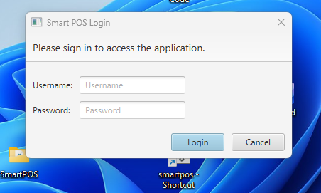
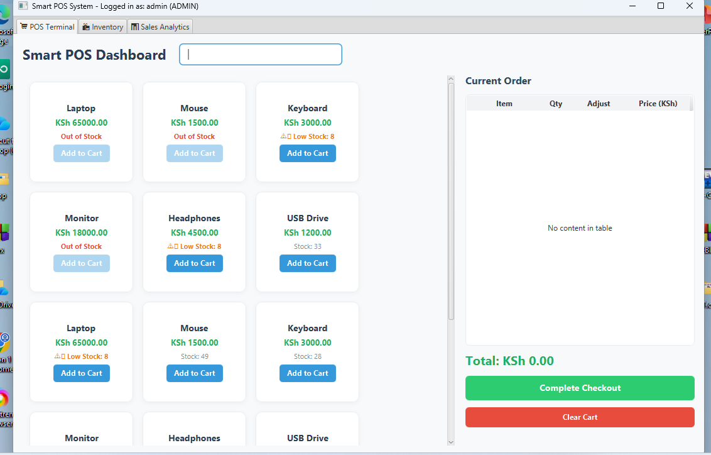
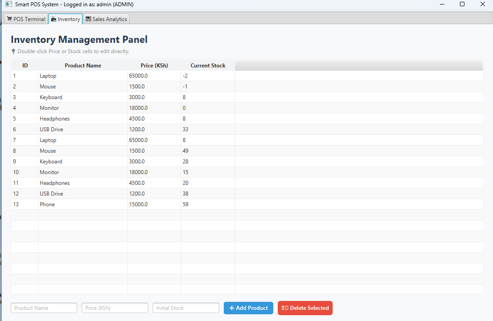
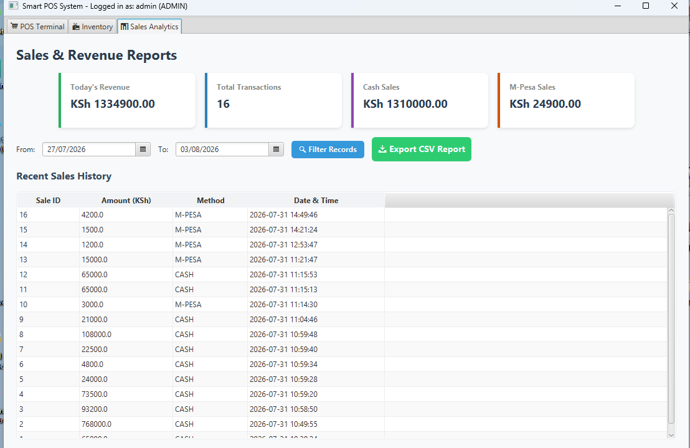

# 🛒 SmartPOS — Desktop Point of Sale System

A desktop-based Point of Sale (POS) system built using **Java, JavaFX, Apache Maven, and MySQL**.

SmartPOS allows users to manage retail transactions, products, inventory, and sales analytics through a graphical user interface with database storage using JDBC.

---

## ✨ Features

* 🔐 User Authentication & Login Screen
* 🛍️ POS Terminal with real-time shopping cart
* 🧾 Automatic receipt calculations
* 📦 Inventory Management Panel
* 🏷️ Product administration
* 📊 Real-time Sales Analytics
* 💰 Revenue Reports
* 📁 Export sales history to CSV
* 🗄️ MySQL database integration using JDBC
* 🎨 Custom user interface styling with CSS

---

## 📸 Screenshots

### 🔐 Login Screen



### 🛒 POS Terminal Dashboard



### 📦 Inventory Management Panel



### 📊 Sales & Revenue Analytics



---

## 🛠️ Technologies Used

* ☕ Java (JDK 17+)
* 🖥️ JavaFX
* 📦 Apache Maven
* 🗄️ MySQL Database
* 🔌 JDBC (Java Database Connectivity)
* 🎨 CSS
* 🔗 Git & GitHub

---

## 📂 Project Structure

```text
SmartPOS/
│
├── .github/
│
├── screenshots/
│   ├── 01login.png
│   ├── 02Dashboard.png
│   ├── 03Inventory.png
│   └── 04Analytics.png
│
├── src/
│   └── main/
│       ├── java/
│       │   └── com/
│       │       └── smartpos/
│       │           ├── App.java
│       │           ├── CartItem.java
│       │           ├── Database.java
│       │           ├── Main.java
│       │           ├── Product.java
│       │           └── smartpos.sql
│       │
│       └── resources/
│           └── style.css
│
├── .gitignore
├── pom.xml
├── smartpos.bat
└── README.md
```

---

## 🗄️ Database Setup

SmartPOS uses **MySQL** for storing products, transactions, and other system data.

### 1️⃣ Start MySQL

Start your MySQL Server using **XAMPP Control Panel** or a standalone MySQL installation.

### 2️⃣ Open MySQL

You can use **phpMyAdmin** or another MySQL client.

### 3️⃣ Create the Database

Create a database named `smartpos`:

```sql
CREATE DATABASE smartpos;
```

### 4️⃣ Import the Database Script

Execute the SQL queries contained in:

```text
src/main/java/com/smartpos/smartpos.sql
```

This will create the required tables and database structure.

---

## ⚙️ Configuration

If your MySQL credentials are different from the default configuration, update the connection details in:

```text
src/main/java/com/smartpos/Database.java
```

Example:

```java
String url = "jdbc:mysql://localhost:3306/smartpos";
String user = "root";
String password = "";
```

Replace the username and password with your local MySQL credentials.

---

## 🚀 How To Run

### 1️⃣ Clone the Repository

```bash
git clone https://github.com/felixtare585-gif/SmartPOS.git
```

Navigate into the project:

```bash
cd SmartPOS
```

### 2️⃣ Compile the Application

```bash
mvn clean compile
```

### 3️⃣ Run the Application

You can either double-click:

```text
smartpos.bat
```

or run the application from the terminal:

```bash
mvn clean compile exec:java -Dexec.mainClass="com.smartpos.Main"
```

---

## 🔮 Future Improvements

Planned improvements for SmartPOS may include:

* 📷 Barcode scanning
* 🧾 Printable receipts
* 👥 Customer management
* 📈 Advanced sales reports
* ⚠️ Low-stock notifications
* 👤 User roles and permissions
* 📊 Improved dashboard analytics
* 📋 Enhanced reporting features

---

## 👨‍💻 Author

**Felix Tare**

🔗 GitHub: [@felixtare585-gif](https://github.com/felixtare585-gif)

---

⭐ **If you find this project useful, consider giving it a star on GitHub!**
